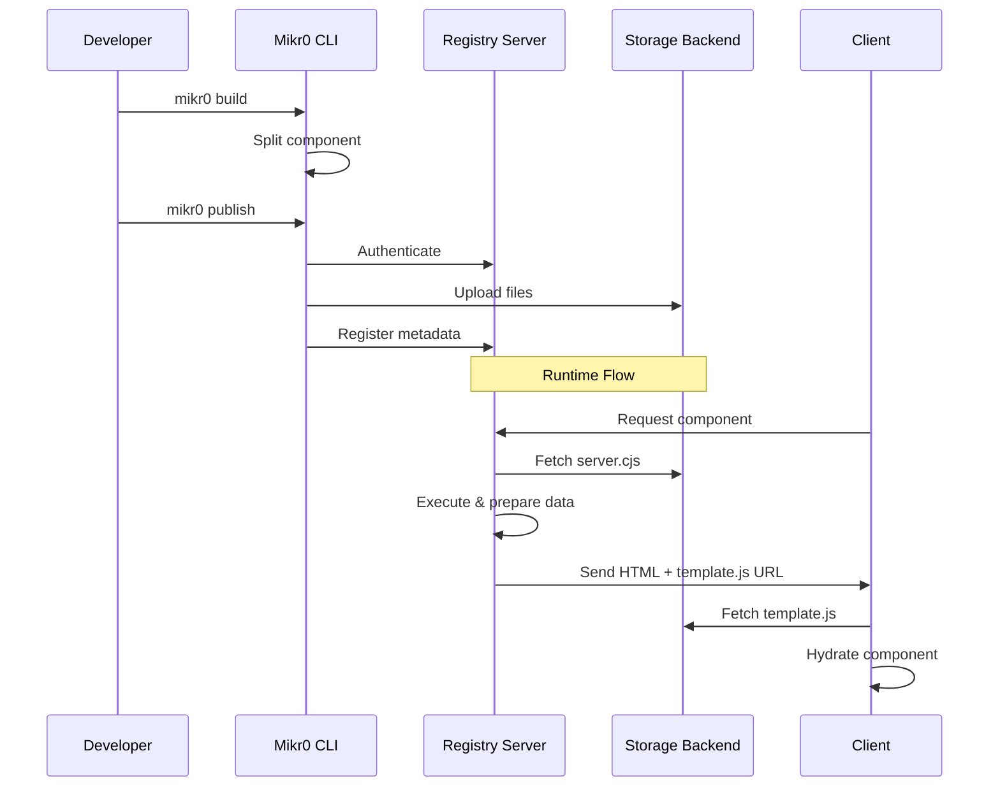
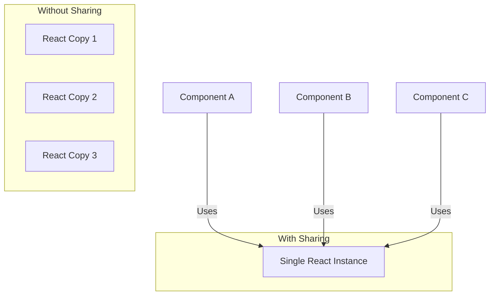
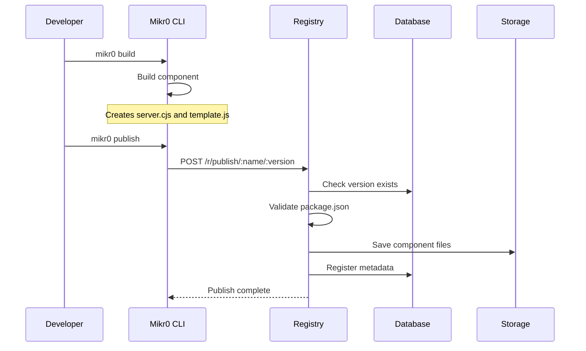

# Mikr0 Architecture

Mikr0 is a framework-agnostic micro-frontend solution that enables on-demand component serving through a centralized registry. It uses Vite as its core building tool and supports multiple frontend frameworks.

## Core Components

### 1. Registry Server

The Registry Server is the central piece of Mikr0, responsible for storing and serving components on demand. The main implementation resides in `packages/mikr0/src/Registry.ts`.

#### Storage System
The registry uses a pluggable storage system (`packages/mikr0/src/storage/storage.ts`) that supports multiple backends:
- Filesystem: Local file storage (`packages/mikr0/src/storage/filesystem.ts`)
- Memory: In-memory storage (development only)
- Azure Blob Storage (`packages/mikr0/src/storage/azure.ts`)
- Amazon S3 (`packages/mikr0/src/storage/s3.ts`)

Each storage implementation must implement the `StaticStorage` interface:

```typescript
interface StaticStorage {
  save: (src: string, destination: string) => Promise<void>;
  saveFile: (destination: string, contents: string) => Promise<void>;
  get: (file: string) => Promise<string>;
  getUrl: (file: string) => URL;
}
```


### 2. Build System

The build system is powered by Vite and handles the component compilation process. The main build logic is located in `packages/mikr0/src/vite/build.ts`.

Key features:
- Splits components into server and client parts
  - `server.cjs`: Server-side rendering logic
  - `template.js`: Client-side hydration code
- Custom Vite plugins for code splitting (defined in `packages/mikr0/src/vite/plugins.ts`)

### 3. CLI Tool

Located in `packages/mikr0/src/cli.ts`, the CLI provides the following commands:

- `build`: Compiles components using Vite and outputs to the dist folder
- `publish`: Uploads built components to the registry server
- `dev`: Runs a local development server with hot-reload capabilities

### 4. Framework Support

Mikr0 provides framework-specific templates through the `create-mikr0` package. Example React implementation can be found in:
- `packages/create-mikr0/component/react/src/index.tsx`
- `packages/create-mikr0/component/react/src/App.tsx`
- `packages/create-mikr0/component/react/vite.config.ts`

Users can bootstrap new components using:

```bash
npm create mikr0
```

This generates a project with:
- Framework-specific configurations
- Proper Vite plugins
- Basic component structure

## Component Lifecycle

### 1. Development Phase

#### Local Development
- Developers start with `npm create mikr0` to scaffold a new component
- The dev server (implemented in `packages/mikr0/src/dev/index.ts`) is started using `mikr0 dev`
- Components can be developed with full HMR (Hot Module Replacement) support
- The dev server runs both client and server code locally

#### Building
When ready for deployment, components go through the build process:

1. `mikr0 build` command triggers the Vite build process
2. The build system splits the component into two parts:
   - `server.cjs`: Contains server-side rendering logic and data fetching
   - `template.js`: Contains the client-side code for hydration

### 2. Publishing Phase

#### Component Publication
The `mikr0 publish` command handles:
1. Authentication with the registry server
2. Uploading the built files to the configured storage backend
3. Registering the component metadata in the registry database

### 3. Runtime Phase

#### Component Serving
When a component is requested:

1. Client requests a component from the Registry Server
2. Registry Server:
   - Loads the component's `server.cjs`
   - Executes any data preparation
   - Renders the initial HTML (optional)
3. Client receives:
   - Initial HTML (for immediate display)
   - URL to the `template.js` file
   - Any prepared data

#### Hydration
1. Browser downloads the `template.js`
2. Component hydrates/render using the server-prepared data
3. Component becomes fully interactive

## Data Flow



## Configuration

### Registry Configuration

The registry server configuration is handled through:
- Main configuration: `packages/mikr0/src/config.ts`
- Type definitions: `packages/mikr0/src/types.ts`

#### Basic Configuration Options
```typescript
interface Config {
  port: number;
  verbose: boolean;
  auth: {
    username: string;
    password: string;
  };
  storage: StaticStorageOptions;
  database: DatabaseOptions;
  cors: CorsOptions;
}
```

#### Storage Configuration

The storage system can be configured for different backends:

```typescript
// Filesystem Storage
{
  type: "filesystem",
  options: {
    folder: "./storage"
  }
}

// Azure Storage
{
  type: "azure",
  options: {
    accountName: "your-account",
    accountKey: "your-key",
    publicContainerName: "public",
    privateContainerName: "private"
  }
}

// S3 Storage
{
  type: "s3",
  options: {
    bucket: "your-bucket",
    region: "your-region",
    credentials: {
      accessKeyId: "your-key",
      secretAccessKey: "your-secret"
    }
  }
}
```

### Component Configuration

Components are created using the `createComponent` function from `mikr0/dev`. This function provides type-safe configuration for parameters, data loading, and lifecycle methods. Here's a typical component setup:

```typescript
import { createComponent } from "mikr0/dev";

export default createComponent({
  // Define typed parameters that your component accepts
  parameters: {
    name: {
      type: "string",
      mandatory: true,
      example: "Mikr0",
      description: "Name of the component"
    }
  },

  // Server-side data loading
  async loader({ parameters, headers }) {
    const { name } = parameters;
    const lang = headers["accept-language"]?.split(",")[0] ?? "en";
    return { name, lang };
  },

  // Component mounting logic
  mount(element, props) {
    // Framework-specific mounting code
    // e.g., React createRoot, Svelte new Component(), etc.
  },

  // Optional cleanup
  unmount(element) {
    // Cleanup logic
  }
});
```

#### Component API

The `createComponent` function accepts the following configuration:

```typescript
interface ComponentConfig<Schema, Data> {
  // Type-safe parameter definitions
  parameters?: {
    [key: string]: {
      type: "string" | "number" | "boolean";
      mandatory: boolean;
      example?: string;
      description?: string;
    }
  };

  // Server-side data preparation
  loader?: (context: {
    parameters: Schema;
    headers: Record<string, string>;
  }) => Promise<Data>;

  // Client-side mounting
  mount: (
    element: HTMLElement,
    props: Data,
    meta: { baseUrl: string; name: string; version: string }
  ) => void;

  // Optional cleanup
  unmount?: (element: HTMLElement) => void;
}
```

### Registry Configuration

The registry server is configured through a configuration object when creating the registry instance:

```typescript
const config: Config = {
  port: 3000,
  verbose: true,
  auth: {
    username: "admin",
    password: "secret"
  },
  storage: {
    type: "filesystem",
    options: {
      folder: "./storage"
    }
  },
  database: {
    // Database configuration
  },
  cors: {
    // CORS options
  }
};

await createRegistry(config);
```

### Security Considerations

1. Authentication
   - Basic authentication is required for publishing components
   - CORS configuration for controlling component access
   - Storage backend credentials should be properly secured

2. Component Isolation
   - Components run in isolated contexts
   - Server-side code execution is sandboxed
   - Client-side code is isolated through shadow DOM (optional)

## Database Implementation

### Overview

The database system in Mikr0 is used to store component metadata and manage component versions. The implementation is located in `packages/mikr0/src/database/index.ts`.

### Supported Backends

Mikr0 supports multiple SQL databases:
- PostgreSQL
- MySQL
- SQLite
- Microsoft SQL Server

### Database Operations

Based on the implementation in `packages/mikr0/src/database/index.ts`, the main database operations include:

```typescript
interface DatabaseOperations {
  // Insert a new component version
  insertComponent(component: {
    name: string;
    version: string;
    client_size: number;
    server_size: number;
    published_at: Date;
    description?: string;
  }): Promise<void>;
  
  // Check if a specific version exists
  versionExists(name: string, version: string): Promise<boolean>;
  
  // Get all versions of a component
  getComponentVersions(name: string): Promise<string[]>;
  
  // Get component details
  getComponent(name: string, version: string): Promise<{
    name: string;
    version: string;
    client_size: number;
    server_size: number;
    published_at: number;
    description?: string;
  }>;
  
  // Get all components and their versions
  getComponents(): Promise<Record<string, string[]>>;
  
  // Get detailed information about all components
  getComponentsDetails(): Promise<Record<string, Record<string, {
    publishedAt: number;
    description?: string;
  }>>>;
}
```

## Actions and Plugins

### Server Actions

Server actions allow components to define server-side functions that can be called from the client. They are defined in the component configuration:

// Implementation in `packages/mikr0/src/routes/component.ts` and `packages/mikr0/src/server.ts`
```typescript
import { createComponent } from "mikr0/dev";

export default createComponent({
  // Component parameters...
  
  actions: {
    // Define server-side actions
    async fetchData(input: { id: string }) {
      // Server-side code
      return { data: "..." };
    },
    
    async submitForm(formData: FormData) {
      // Process form submission
      return { success: true };
    }
  }
});
```

### Client-side Usage

Actions are automatically available on the client through the `serverClient` proxy:

Client runtime implementation in `packages/mikr0/src/client/client.ts`

```typescript
import { serverClient } from "mikr0/dev";

// Type-safe action calls
const result = await serverClient.fetchData({ id: "123" });
const submission = await serverClient.submitForm(formData);
```

### Plugins

Plugins provide a way to extend component functionality with reusable features. There are two contexts where plugins are used:

#### 1. Development Environment

When developing locally, you can define mock plugins in your component for testing:

```typescript
import { createComponent } from "mikr0/dev";

export default createComponent({
  // Define required plugins for local development
  plugins: {
    getCurrentUser: async () => ({ id: '1', name: 'Test User' }),
    isAuthenticated: async () => true,
    trackEvent: (name: string) => console.log('Event:', name)
  },

  // Use plugins in loader (works in both dev and production)
  async loader({ plugins }) {
    const user = await plugins.getCurrentUser();
    plugins.trackEvent("component_loaded");
    return { user };
  }
});
```

#### 2. Registry Environment

In the actual registry, plugins are implemented as flat functions when creating the registry:

```typescript
await createRegistry({
  // ... other config
  plugins: {
    getCurrentUser: async () => { /* real implementation */ },
    isAuthenticated: async () => { /* real implementation */ },
    trackEvent: (name, data) => { /* real implementation */ }
  }
});
```

Note: The plugins defined in `createComponent` are only used during local development with `mikr0 dev`. When the component is published to the registry, it will use the plugins implemented in the registry configuration.

## Development Server

### Overview

The development server (`mikr0 dev`) creates a local environment that simulates how your component will run in production, but optimized for development. Here's how it works:

### Architecture

1. **Local Registry**
   - Creates an in-memory version of the registry
   - Uses SQLite in-memory for component metadata
   - Uses memory storage for component files
   - Simulates the same plugin system as production

2. **Component Processing**
   - Watches your component source files
   - Automatically splits code into server and client parts
   - Maintains hot module replacement (HMR) for instant updates

3. **Development Environment**
   - Sets up a development page with your component
   - Injects the Mikr0 client runtime
   - Provides real-time error feedback
   - Enables testing with different parameters

### How It Works

1. **Initial Setup**
   When you run `mikr0 dev`, the server:
   - Creates a temporary build environment
   - Sets up Vite for development
   - Starts a local registry instance

2. **Component Development**
   - Your component is automatically registered in the local registry
   - Changes are instantly reflected through Vite's HMR
   - Server-side code runs in the local registry
   - Client-side code runs in the browser with hot reloading

3. **Request Flow**
   ```mermaid
   graph TD
     A[Browser] --> B[Dev Server]
     B --> C[Local Registry]
     C --> D[Your Component]
     D --> E[Live Updates]
     E --> A
   ```

### Development Features

1. **Instant Feedback**
   - Code changes reflect immediately
   - Server-side errors show in the console
   - Client-side updates without page refresh

2. **Local Environment**
   - Simulated registry environment
   - Local plugin implementations
   - In-memory storage for fast development

3. **Development Tools**
   - Parameter testing interface
   - Plugin mocking capabilities
   - Real-time error reporting

This setup allows you to develop components as if they were running in a full Mikr0 environment while maintaining a fast development cycle and immediate feedback loop.

### Development Server

#### Registry Fallback

The development server supports falling back to another registry when a component is not found locally. This is particularly useful when:

- Developing new components while using existing ones from production
- Testing component interoperability
- Working with shared component libraries

Configuration:
```typescript
// Via CLI
mikr0 dev --registryFallbackUrl="https://production-registry.example.com"

// Or in code
await createRegistry({
  // ... other options
  registryFallbackUrl: "https://production-registry.example.com"
});
```

The fallback process works as follows:
1. Component is requested from local dev registry
2. If not found locally and fallback URL is configured:
   - Request is forwarded to fallback registry
   - Response (including headers) is proxied back to client
3. If component isn't found in either registry, a ComponentNotFoundError is thrown

This feature enables seamless development workflows where new components can be developed locally while still having access to the full production component library.

## Client Runtime

### Overview

The client runtime is the browser-side component of Mikr0, responsible for loading and managing micro-frontend components. It's delivered through a single JavaScript file (`client.js`) that's served from `/r/client.js` on the registry.

### Web Component Implementation

The core of the client runtime is the `<mikro-component>` custom element. This web component:
- Handles component lifecycle
- Manages component loading and rendering
- Provides automatic cleanup
- Supports dynamic updates through attribute changes

Example usage:
```html
<mikro-component 
  src="https://registry.example.com/r/component/my-component/1.0.0"
  compress="1000"
></mikro-component>
```

### Features

1. **Automatic Component Loading**
   - Fetches component metadata and code from the registry
   - Handles data compression for large parameter sets
   - Manages component mounting and unmounting
   - Provides error handling and recovery

2. **Parameter Compression**
   - Automatically compresses large URL parameters
   - Uses `deflate-raw` compression
   - Configurable minimum size threshold
   - Transparent decompression on the server side

3. **Global Utilities**
   The runtime exposes utilities through the `window.mikr0` object:

   ```typescript
   interface Mikr0Global {
     loaded: boolean;
     verbose?: boolean;
     getAction: (config: ActionConfig) => Promise<any>;
     events: EventSystem;
   }
   ```

### Event System

A global event system enables cross-component communication:

```typescript
window.mikr0.events = {
  // Subscribe to events
  on(eventName: string, callback: Function): void;
  
  // Emit events
  fire(eventName: string, data: any): void;
  
  // Unsubscribe from events
  off(eventName: string | string[], handler?: Function): void;
  
  // Clear all subscriptions
  reset(): void;
}
```

### Component Lifecycle

1. **Mounting**
   - Component source URL is validated
   - Registry is contacted for component data
   - Component code is downloaded and executed
   - Mount function is called with initial data

2. **Updates**
   - Watches for `src` attribute changes
   - Re-renders component when source changes
   - Maintains component state during updates

3. **Cleanup**
   - Calls component unmount function
   - Removes event listeners
   - Cleans up DOM elements

### Server Communication

1. **Component Loading**
   ```mermaid
   sequenceDiagram
       Browser->>Registry: GET /r/component/name/version
       Registry-->>Browser: {template, data, metadata}
       Browser->>Registry: GET template.js
       Registry-->>Browser: Component Code
       Browser->>Browser: Mount Component
   ```

2. **Action Handling**
   ```mermaid
   sequenceDiagram
       Component->>window.mikr0: Call getAction
       window.mikr0->>Registry: POST /r/action/name/version
       Registry-->>window.mikr0: Action Result
       window.mikr0->>Component: Return Data
   ```

### Security Considerations

1. **Script Safety**
   - Components run in isolated contexts
   - Scripts are carefully reanimated to prevent XSS
   - Cross-origin restrictions are enforced

2. **Data Protection**
   - Parameter compression is optional
   - Sensitive data should use POST actions
   - Component sources must be trusted

## Server-Side Component Execution

### Overview

When a component is requested from the registry, a sophisticated system handles the loading, execution, and caching of server-side components. This process is critical for performance and security.

### Component Request Flow

1. **Initial Request**
   ```mermaid
   sequenceDiagram
       Client->>Registry: GET /r/component/name/version
       Registry->>Database: Check component exists
       Registry->>Storage: Fetch server.cjs
       Registry->>VM: Execute in sandbox
       VM->>Registry: Return data
       Registry->>Client: Send response
   ```

### Component Server Implementation

The server-side execution is handled by two main parts:

1. **Component Route Handler** (`packages/mikr0/src/routes/component.ts`)
   - Validates component existence and version
   - Handles parameter parsing and compression
   - Orchestrates the component execution
   - Returns the response to the client

2. **Server Execution Engine** (`packages/mikr0/src/server.ts`)
   - Manages component code execution in a sandbox
   - Implements caching strategy
   - Handles timeouts and errors
   - Provides plugin context

### Caching Strategy

The system uses an LRU (Least Recently Used) cache for optimal performance:

```typescript
const cache = new LRUCache<string, Server>({ 
  max: 500  // Maximum number of cached components
});
```

Key features:
- Components are cached by `name/version` combination
- Each cached entry contains the parsed server code and actions
- Immutable versions ensure cache validity
- Automatic cleanup of least used components

### Secure Execution Environment

Components run in a sandboxed VM context:

// Sandbox implementation in `packages/mikr0/src/server.ts` using wrapper from `packages/mikr0/src/require-wrapper.ts`
```typescript
const vmContext = {
  require: createRequireWrapper(dependencies),
  module: { exports: {} },
  console,
  setTimeout,
  Buffer,
  Promise,
  process: { nextTick },
  AbortController,
  fetch,
  // Restricted access to dangerous globals
  eval: undefined
};
```

### Component Loading Process

1. **Cache Check**
   ```typescript
   const cached = cache.get(`${name}/${version}`);
   if (cached) return cached;
   ```

2. **Server Code Loading**
   - Fetches `server.cjs` from storage
   - Parses and validates the component
   - Extracts loader and actions

3. **Execution**
   ```typescript
   // Create isolated domain for error handling
   const domain = Domain.create();
   
   domain.run(async () => {
     // Set execution timeout
     setTimeout(() => {
       reject(new Error("Timeout exceeded"));
     }, opts.timeout);

     // Execute component code
     const data = await loader(serverContext);
     resolve(data);
   });
   ```

### Version Immutability

The system relies on version immutability for several critical features:

1. **Caching Confidence**
   - Once a version is published, it never changes
   - Cache entries remain valid indefinitely
   - No need for cache invalidation strategies

2. **Consistent Execution**
   - Same version always produces same output
   - Predictable behavior across requests
   - Reliable error tracking

3. **Performance Benefits**
   - Aggressive caching possible
   - No version checking needed after initial load
   - Reduced storage access

### Error Handling

The execution system implements multiple layers of protection:

1. **Timeout Protection**
   - Each execution has a configurable timeout
   - Long-running components are terminated
   - Resources are properly cleaned up

2. **Domain Isolation**
   - Each execution runs in its own domain
   - Errors don't affect other requests
   - Clean error reporting to clients

3. **Resource Management**
   ```typescript
   try {
     // Component execution
   } catch (err) {
     // Error handling
   } finally {
     // Resource cleanup
   }
   ```

### Performance Considerations

1. **Caching Strategy**
   - Hot components stay in memory
   - Cold components are automatically evicted
   - Cache size is configurable

2. **Resource Usage**
   - Sandboxed execution limits memory usage
   - Shared module cache across executions
   - Efficient cleanup of unused resources

3. **Response Time**
   - First request: Storage + Parse + Execute
   - Subsequent requests: Execute only
   - Minimal overhead for cached components

## Dependency Management and Code Isolation

### Overview

One of the most critical aspects of Mikr0's registry is how it manages dependencies for server-side component execution. Since all components run on the same registry server, a sophisticated system is needed to:
- Share dependencies efficiently across components
- Control access to sensitive Node.js modules
- Manage memory usage
- Ensure security through isolation

### Dependency Sharing Architecture

#### Why Share Dependencies?

1. **Memory Efficiency**


- Without sharing: Each component bundles all dependencies
- With sharing: Single instance of each dependency in memory
- Critical for registry scalability

### Implementation Details

#### 1. Build-time Configuration

In `packages/mikr0/src/vite/build.ts`, server builds are configured as CommonJS:
```typescript
build: {
  lib: {
    entry,
    formats: ["cjs"],  // Forces CommonJS format
    fileName: "server"
  }
}
```

Key aspects:
- All imports are marked as external
- Dependencies are not bundled with component code
- Resulting bundle is minimal, containing only component logic

#### 2. Require Wrapper

The `packages/mikr0/src/require-wrapper.ts` implements a secure require system:

```typescript
function createRequireWrapper(injectedDependencies: string[] | true) {
  return function requireWrapper(requirePath: string) {
    const moduleName = requirePackageName(requirePath);
    const isAllowed = injectedDependencies === true 
      ? true 
      : !!moduleName && injectedDependencies.includes(moduleName);

    if (!isAllowed) {
      throw new Error(`Dependency "${requirePath}" is not allowed`);
    }

    return (
      requireDependency(requirePath) ||
      requireCoreDependency(requirePath) ||
      throwError(requirePath)
    );
  };
}
```

Features:
- Validates dependency access
- Handles both npm packages and Node.js core modules
- Provides clear error messages for unauthorized access

#### 3. Registry Configuration

When creating a registry, allowed dependencies must be specified:

```typescript
createRegistry({
  // ... other config
  dependencies: [
    "react", 
    "lodash",
    // Explicitly allow specific Node.js modules
    "crypto",
    "buffer"
  ]
  // Or allow all dependencies (dangerous in production)
  // dependencies: true
})
```

### Security Considerations

1. **Node.js Core Modules**
   - Access to sensitive modules (fs, child_process) can be blocked
   - Only essential core modules should be allowed
   - Prevents server filesystem access

2. **Dependency Validation**
   ```typescript
   const isCoreDependency = (x: string) => 
     coreModules.includes(x);

   const requireCoreDependency = (x: string) =>
     (isCoreDependency(x) && tryRequire(x)) || undefined;
   ```

### Technical Limitations

1. **CommonJS Requirement**
   - Server components must be built as CommonJS
   - Required for require function interception
   - ESM `import` statements cannot be intercepted

2. **ESM Compatibility**
   - Some modern packages are ESM-only
   - Registry must carefully consider dependency compatibility
   - Node.js 22/23 improves CJS->ESM interop

### Best Practices

1. **Dependency Management**
   ```typescript
   // Registry configuration
   {
     dependencies: [
       // Framework dependencies
       "react", "react-dom",
       
       // Utility libraries
       "lodash", "date-fns",
       
       // Safe Node.js core modules
       "crypto", "buffer", "events"
     ]
   }
   ```

2. **Version Control**
   - Registry should control dependency versions
   - Prevents version conflicts
   - Ensures consistent behavior

3. **Security Auditing**
   - Regularly review allowed dependencies
   - Monitor for security vulnerabilities
   - Update dependency whitelist as needed

## Publishing Process

### Overview

The publishing process in Mikr0 handles how components are packaged, validated, and stored in the registry. This process ensures components are:
- Properly built and optimized
- Version controlled
- Securely stored
- Ready for on-demand serving

### Publishing Flow



### Component Package Structure

When a component is built for publishing, it creates:

```
dist/
├── server.cjs       # Server-side component code
├── template.js      # Client-side component code
└── package.json     # Component metadata
```

The `package.json` includes Mikr0-specific metadata:
```typescript
interface PublishedPackageJson {
  name: string;
  version: string;
  mikr0: {
    parameters?: ParametersSchema;
    serverSize: number;
    clientSize: number;
    publishDate?: string;
  }
}
```

### Publishing Process

1. **Build Phase**
   - Component is built using Vite
   - Code is split into server and client parts
   - Assets are optimized and prepared
   - Metadata is generated

2. **Validation Phase**
   ```typescript
   // Version uniqueness check
   const exists = await database.versionExists(name, version);
   if (exists) {
     throw new Error("Version already exists");
   }

   // Package validation
   if (config.publishValidation) {
     const validation = config.publishValidation(pkgJson);
     if (!validation.isValid) {
       throw new Error(validation.error);
     }
   }
   ```

3. **Storage Phase**
   - Files are uploaded to configured storage
   - Metadata is stored in database
   - Version information is updated

### Version Management

1. **Version Format**
   - Follows semantic versioning (X.Y.Z)
   - Each version is immutable
   - Supports version ranges for client requests

2. **Version Resolution**
   ```typescript
   // Example version patterns
   "1.0.0"      // Exact version
   "1.x"        // Latest 1.x version
   "1.1.x"      // Latest 1.1.x version
   undefined    // Latest version
   ```

### Security Considerations

1. **Authentication**
   - Basic auth required for publishing
   - Configurable credentials per registry
   - Separate publishing and viewing permissions

2. **Package Validation**
   - Size limits enforcement
   - Format verification
   - Custom validation hooks available

3. **Storage Security**
   - Secure file storage
   - Access control for private components
   - Audit trail of publications

### Best Practices

1. **Version Management**
   ```bash
   # Build and publish a new version
   mikr0 build
   mikr0 publish
   ```

2. **Package Organization**
   - Clear version numbering
   - Comprehensive component documentation
   - Proper dependency declarations

3. **Publishing Strategy**
   - Regular security updates
   - Clear deprecation policy
   - Version compatibility documentation